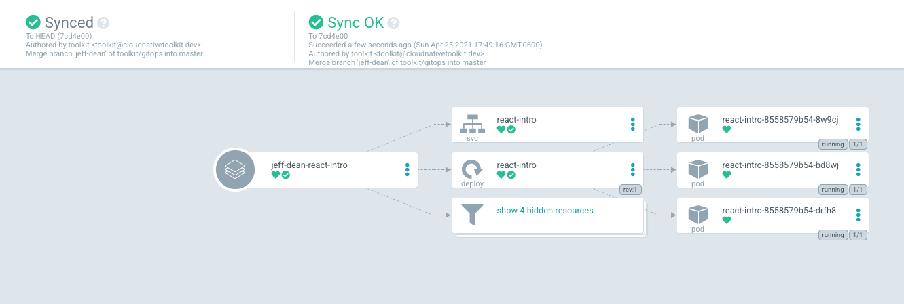

# Argo - Continuous Delivery for QA

## Prerequisites

> 🛑 **Stop**: make sure your pipeline is green before setting up ArgoCD

The QA folder in the Gitops repo will already have been created for you by the Tekton pipeline.

## Setup

Use the following instructions to set up a new continuous delivery controller using ArgoCD.

### Create the project

1. Determine the name of the new project. Usually `react-intro-<USER ID>-qa` (for example `react-intro-35-qa`)

1. Create the project with `oc new-project react-intro-<USER ID>-qa` (for example `oc new-project react-intro-35-qa`)

By creating the project, you will have permissions to manually edit objects in that project (like Deployments).

### Add ArgoCD App

1. Run `oc console` to open the web console.
1. On the OpenShift console page, Click the "9 box" menu, then select "ArgoCD"
   
1. Accept the security warnings (easiest in Chrome)
1. Login
   - if "Login via OpenShift" is available, do that
   - if not, run `igc credentials` to get the password
1. Click "New App"
1. Fill in the form
   - General
     - Application name: `react-intro-<user-number>-qa` or `squad<squad-number>-qa`
     - Project = default
   - Sync Policy = automatic
   - Check PRUNE RESOURCES and SELF HEAL
   - Check "use a schema to validate resource manifests"

- Source
  - Repository = url to gitops repository ("9 box" menu, click "Git Ops")
  - Revision = HEAD
  - Path = path to the project environment folder you just created.
    - For react-intro `qa/react-intro-<user-number>/react-intro`
    - For projects `qa/squad-<squad-number>/<repo-name>`
- Destination
  - cluster = select the one available option
  - namespace = the target namespace. Should be the same as "Application name" above
- Click create at the top

### Add the image pull policy

Now the ArgoCD app is displayed. Shortly you will notice that the pod creation failed, and it has a status of `ImagePullBackOff`.

This is because the new namespace is trying to pull images created in another namespace.

1. Give the new environment permission to pull images from qa namespace

   ```bash
   oc policy add-role-to-group system:image-puller system:serviceaccounts:<new-project-name> -n <dev-project-name>
   ```

   For your react intro app:

   ```bash
   oc policy add-role-to-group system:image-puller system:serviceaccounts:react-intro-35-qa -n react-intro-35-dev
   ```

   If successful, you will see something like the following:

   ```
   clusterrole.rbac.authorization.k8s.io/system:image-puller added: "system:serviceaccounts:<new-project-name>"
   ```

1. Click the menu on the right side of the pod in ArgoCD then select "delete". OpenShift will immediately create a new pod and this time it will have permission to pull images from the other namespace.

1. If successful, you will see something like the following when you open the ArgoCD controller (Note: every heart is green):
   

## What just happened?

You have a new QA environment.

Your CI/CD pipeline now looks like the following sequence diagram:


[Click here to view/edit the diagram](https://www.websequencediagrams.com/cgi-bin/cdraw?lz=dGl0bGUgQ29udGludW91cyBJbnRlZ3JhdGlvbgoKcGFydGljaXBhbnQgRGV2ZWxvcGVyAAkNQ29kZSBSZXBvAB8NVGVrdG9uADINR2l0T3BzABkSQXJnAC4OSzhzIFFBCgoAZwktPgBcCTogZ2l0IHB1c2gKAHAJLT4AaAY6IHdlYmhvb2sKAHgGLT4AaAs6IHVwZGF0ZSBRQSBmb2xkZXIKQXJnbwAVD3N5bmMAEQcAgQAGAA0G&s=default)

## Promoting a new version to QA

1. Make a change to your application (for example changing the text in your `App` component)
1. Add, commit and push your change to Gogs
1. Your Tekton pipeline should run automatically, and update the QA folder in the gitops repo
1. Argo should automatically see the change to the QA folder in the gitops repo and sync

## Resources:

- https://cloudnative101.dev/lectures/continuous-deployment/
- https://github.com/argoproj/argo-cd/issues/2650
- https://argoproj.github.io/argo-cd/faq/#why-is-my-app-out-of-sync-even-after-syncing
