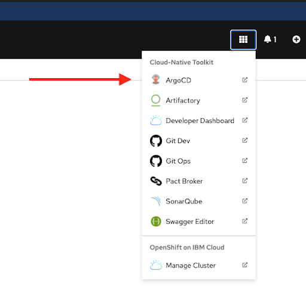
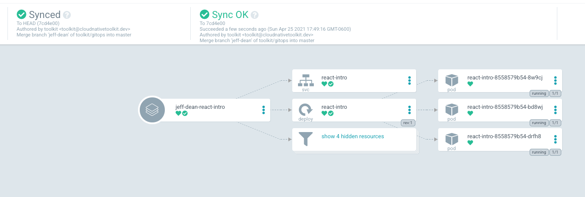
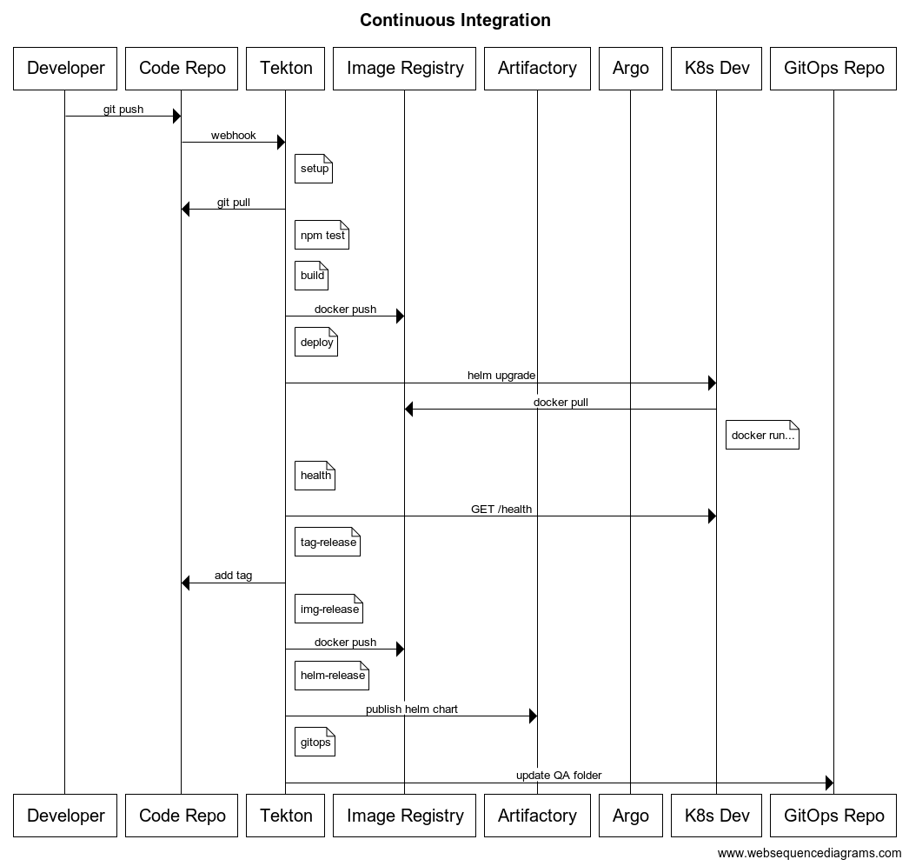

# CD with ArgoCD

## Prerequisites

1. Tekton pipeline is **green** - all stages are passing

## Setup

Use the following instructions to set up a new continuous delivery controller using ArgoCD.

> **Stop**: make sure your pipeline is green before setting up ArgoCD

1. Determine the name of the new project. Usually `project<user-number>-<app-repo-name>-<environment>`

1. Update GitOps repository

   1. Run `oc console` to open the web console.
   1. Click the "9 box" menu, then select "Git Ops", then copy the http link.
   1. In the terminal, CD to your $HOME directory `cd ~`
   1. Type `git clone `, paste in the gitops http url, hit enter.
   1. `cd gitops`
   1. `git checkout -b add-<user-number>-<app-repo-name>-<environment>` or `git checkout -b add-<squad-number>-<app-repo-name>-<environment>`
   1. Run `code .` and find the application you want to deploy under the `/qa` folder, and copy that entire folder to the new `<environment>` folder (i.e. production)
   1. Git add, commit, and push to your branch.
   1. Create a new pull request and immediately merge it. After merging, click the delete branch button.

1. Add ArgoCD controller
   1. Run `oc console` to open the web console.
   1. On the OpenShift console page, Click the "9 box" menu, then select "ArgoCD"
      
   1. Accept the security warnings (easiest in Chrome)
   1. Login via openshift
   1. Allow selected permissions
   1. Click "new app"
   1. Fill in the form
      - General
        - Application name: Thus must be unique to the entire cluster. use `project<user-number>-<app-repo-name>-<environment>` or `squad<squad-number>-<app-repo-name>-<environment>`
          - Project = default
        - Sync Policy = automatic
          - Check PRUNE RESOURCES and SELF HEAL
        - Sync Options = Check "use a schema to validate resource manifests" and "auto-create namespace"
      - Source
        - Repository = url to gitops repository ("9 box" menu, click "Git Ops")
        - Revision = HEAD
        - Path = path to the project environment folder you just created. Usually `<environment>/project<user-number>/<app-repo-name>`
      - Destination
        - cluster = select the one available option
        - namespace = the target namespace. Usually `project<user-number>-<app-repo-name>-<environment>`
   - Click create at the top
1. Now the ArgoCD controller is displayed. Shortly you will notice that the pod creation failed, and it has a status of `ImagePullBackOff`.
   This is because the new namespace is trying to pull images created in another namespace. You will fix this in the next step.
1. Give the new environment permission to pull images from qa namespace
   1. run `oc project <new-project-name>`
   1. run `oc policy add-role-to-group system:image-puller system:serviceaccounts:<new-project-name> -n <dev-project-name>`
      If successful, you will see something like the following:
      ```shell
      clusterrole.rbac.authorization.k8s.io/system:image-puller added: "system:serviceaccounts:<new-project-name>"
      ```
   1. Click the menu on the right side of the pod in ArgoCD then select "delete". OpenShift will immediately create a new pod and this time it will have permission to pull images from the other namespace.
1. If successful, you will see something like the following when you open the ArgoCD controller (Note: every heart is green):
   
1. What just happened?

   You have a new environment. Let's assume it is `production`.

   `qa` and `production` are running the same version of your application because the version number specified in gitops `<environment>/project<user-number>/<app-repo-name>/requirements.yaml` is the same in both environments.

   Your CI/CD pipeline now looks like the following sequence diagram:
   

## Promoting a new version to production

1. Update the application version in the `package.json` file and commit it, so a new image is built by the Tekton pipeline.
1. Update GitOps repository
   1. In the terminal, CD to your $HOME directory `cd ~/gitops`
   1. `git checkout -b update-<user-number>-<app-repo-name>-<environment>` or `git checkout -b update-<squad-number>-<app-repo-name>-<environment>`
   1. Update and update the version in the `<environment>/project<user-number>/<app-repo-name>/requirements.yaml` file.
   1. Git add, commit, and push to your branch.
   1. Create a new pull request and immediately merge it. After merging, click the delete branch button.
   1. Open the ArgoCD controller and note the new version is running in production.

## Troubleshooting

| Error Message                        | Solution                                                                                                                                                                                      |
| ------------------------------------ | --------------------------------------------------------------------------------------------------------------------------------------------------------------------------------------------- |
| `ErrImagePull` or `ImagePullBackOff` | Allow your production namespace to pull images created from your dev namespace<br>run `oc policy add-role-to-group system:image-puller system:serviceaccounts:<new-project> -n <dev-project>` |
| `error: object has been deleted`     | The Argo project has the same name as your repository. Delete the Argo project and recreate it with a new unique name.                                                                        |

## Resources:

- https://github.com/argoproj/argo-cd/issues/2650
- https://argoproj.github.io/argo-cd/faq/#why-is-my-app-out-of-sync-even-after-syncing
