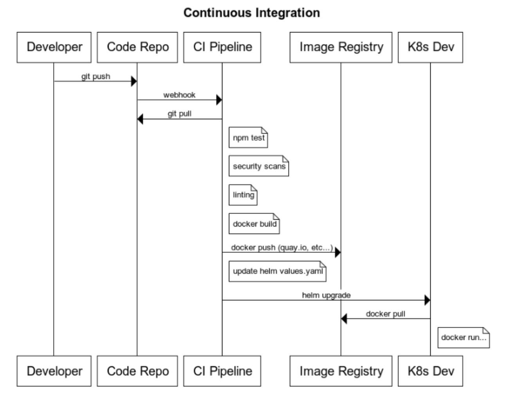

# Continuous Integration

https://www.websequencediagrams.com/

```
title Continuous Integration

participant Developer
participant Code Repo
participant CI Pipeline
participant Image Registry
participant K8s Dev

Developer->Code Repo: git push
Code Repo->CI Pipeline: webhook
CI Pipeline->Code Repo: git pull
note right of CI Pipeline: npm test
note right of CI Pipeline: security scans
note right of CI Pipeline: linting
note right of CI Pipeline: docker build
CI Pipeline->Image Registry: docker push (quay.io, etc...)
note right of CI Pipeline: update helm values.yaml
CI Pipeline->K8s Dev: helm upgrade
K8s Dev->Image Registry: docker pull
note right of K8s Dev: docker run...
```



## Troubleshooting

**Deploy step fails with message 'error: object has been deleted'**

This happens when you've named your Argo project the same as your repo name.

Delete the Argo project and recreate it with a new name. See the following links for more info:

- https://github.com/argoproj/argo-cd/issues/2650
- https://argoproj.github.io/argo-cd/faq/#why-is-my-app-out-of-sync-even-after-syncing
