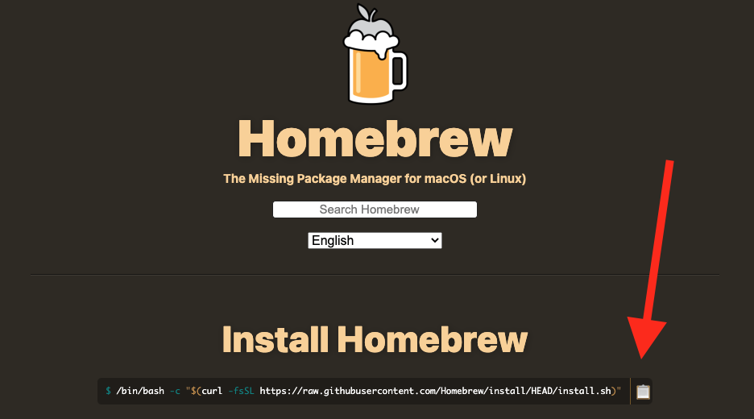

# Computer Setup > Homebrew

**✅ ✅  How do I know if I completed this step? ✅ ✅**

1. Open a new Terminal window (or tab)
1. Run the following command

```
brew doctor
```

If you see output, it means it was successful.

If you see `brew not found` then follow these instructions to install:

1. Visit https://brew.sh/
1. Click the "Copy" link
1. Open a new Terminal window (or tab)
1. Paste the command and hit the ENTER key




