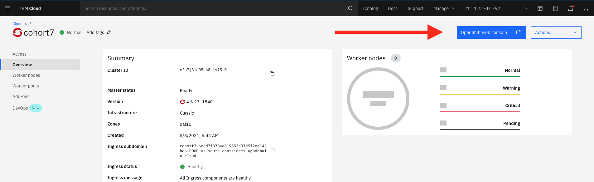

# IBM Cloud Setup

## Prereqs

1. If you are a Windows user, make sure you've [installed WSL](windows.md) and that you follow these steps from within WSL (ubuntu)
1. Make sure you have [set zsh](./zsh.md)  as your default shell
1. Make sure you have [homebrew](./homebrew.md)
1. Make sure you have [node](./node.md)

## Install the `ibmcloud` CLI

**✅ ✅ How do I know if I completed this step? ✅ ✅**

Type `which ibmcloud`

If you see output like `/usr/local/bin/ibmcloud` then you have successfully installed it.

If you see output like `not found` then you need to install it:

1. Visit https://cloud.ibm.com/docs/cli?topic=cli-install-ibmcloud-cli
1. Follow the instructions for your operating system

## Install the `ibmcloud` container plugin

From your terminal, run:

```
ibmcloud plugin list
```

You should see `container-service` in the list of plugins.

If you do not see `container-service` then do the following:

1. Visit https://cloud.ibm.com/docs/containers?topic=containers-cs_cli_install
1. Follow the instructions

(At the time of this writing it's `ibmcloud plugin install container-service`)

## Access the OpenShift Cluster

In order to login to the cluster from the command line, you must first login on the website.

1. Log into https://cloud.ibm.com with your IBM email address
1. Make sure that "DTEV2" is selected from the account menu
1. Under "Resource Summary" click "Clusters"
1. Click your cohort's cluster
1. Click "OpenShift Web Console"
1. You should see the OpenShift web console 





## Get an API Key

1. Log into https://cloud.ibm.com with your IBM email address
1. Make sure that "DTEV2" is selected from the account menu
1. Click on Manage > Access (IAM)
1. Under "My IBM Cloud API keys" click "View all"
1. Click "Create an IBM Cloud API key"
1. Enter a name and create the key
1. Download the key to your computer (if you don't, you'll have to create another one)


## Login to `ibmcloud`

In order to test that your account works, login using your API key.

Replace `YOUR_API_KEY` with your actual API key and then run this command:

```
ibmcloud login --apikey YOUR_API_KEY -r us-south
```

**✅ ✅ How do I know if I completed this step? ✅ ✅**

Run `ibmcloud ks clusters`

You should see your cohort's cluster in the list.

If you don't, it could be because:

1. You created your API key in the wrong account (your personal account, as opposed to DTEV2)
1. You have not been granted access to the cluster - contact your instructor

## Install required dependencies

```
brew install yq@3
brew install jq
```

## Install the toolkit developer tools

1. Visit https://cloudnativetoolkit.dev/getting-started/dev-env-setup
1. Follow instructions:
    ```
   curl -sL shell.cloudnativetoolkit.dev | bash -
   source ~/.zshrc
    ```
1. Run `icc --add-account`
1. name the account `garage`
1. Paste in the API key you generated above
1. Run `icc --generate`

**✅ ✅ How do I know if I completed this step? ✅ ✅**

When you run `icc` you should see at least one cluster listed (the cluster for your cohort).

When you run `icc <cluster name>` you should not see an error message.

### Verifying OC Plugins

When you run `oc plugin list` you should see several lines, including one with `kubectl-pipeline`.

If not, it's likely that your npm bin directory is not in your path.

If you installed Node with the installer, this might work:

```
echo "export PATH=\"\${HOME}/.npm/bin:\${PATH}\"" >> ~/.zshrc
source ~/.zshrc
```

If you installed Node via NVM, this might work:

```
nvm alias default node
```

Then run `oc plugin list` again.
