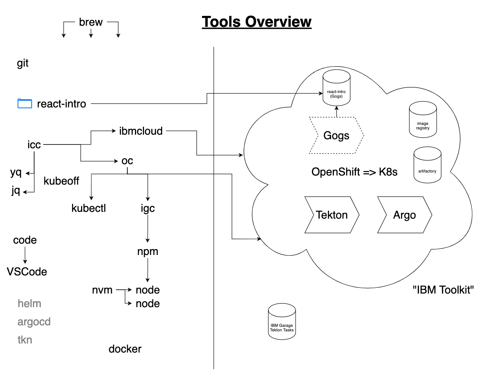

## Software installed on your machine

| Program              | Description                                                                                             |
| -------------------- | ------------------------------------------------------------------------------------------------------- |
| `brew`               | A package manager - allows you to install software on your machine                                      |
| `nvm`                | Node Version Manager - allows you to easily install and use multiple versions of NodeJS on your machine |
| `node`               | A JavaScript runtime                                                                                    |
| `npm`                | Node Package Manager - allows you to install NodeJS libraries                                           |
| `kubectl`            | Open source CLI for interacting with Kubernetes clusters                                                |
| `oc`                 | OpenShift CLI - everything kubectl has plus OpenShift-specific commands                                 |
| `igc`                | IBM Garage CLI - https://github.com/cloud-native-toolkit/ibm-garage-cloud-cli                           |
| `icc`                | Allows you to quickly login to clusters (and switch between them)                                       |
| `yq` / `jq`        | Command-line utitilies for managing JSON and YAML files (required by `icc`)                             |
| `code`               | Visual Studio Code CLI - allows you to launch VSCode from the command line                              |
| `docker`             | A container runtime - allows you to build docker images and run containers                              |
| `ibmcloud`           | The IBM Cloud CLI - allows you to login to IBM cloud to access your clusters (required by `icc`)        |
| `git`                | A version control system - allows you to save snapshots of your code and collaborate on codebases       |
| `kubeoff` / `kubeon` | Allows you to show/hide the Kubernetes cluster you are currently logged into                            |

### Misc other programs

The following programs are installed, but will not be used in class

| Program  | Description                                                                               |
| -------- | ----------------------------------------------------------------------------------------- |
| `helm`   | Helm CLI - allows you to generate YAML files from templates locally                       |
| `tkn`    | The Tekton CLI - allows you to kick off pipelines, view logs etc... from the command line |
| `argocd` | The ArgoCD CLI - allows you to manage ArgoCD from the command line                        |
