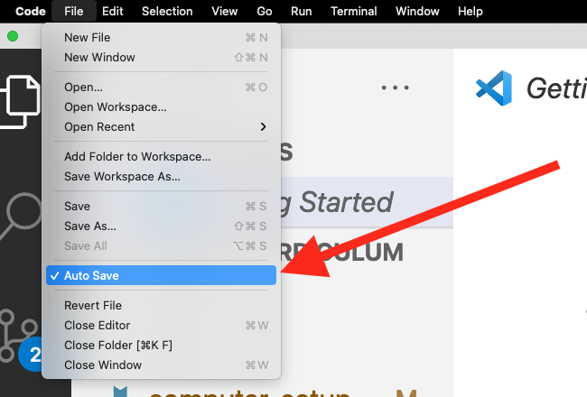

# Computer Setup > Visual Studio Code

## Install (Mac)

Follow [these instructions](https://code.visualstudio.com/docs/setup/mac) on Mac.

**✅ ✅ How do I know if I completed this step? ✅ ✅**

Open Terminal and run the following command:

```shell
ls "/Applications/Visual Studio Code.app"
```

It's installed correctly if you see:

```
Contents
```

If you don't see the word `Contents`, that means it's not installed correctly. Drag it to your `Applications` folder.

## Install the `code` command line tool

Follow [these instructions](https://code.visualstudio.com/docs/setup/mac) on Mac.

**✅ ✅ How do I know if I completed this step? ✅ ✅**

1. Open a new Terminal window or tab
1. Type `which code`

It's installed correctly if you see something like:

```shell
/usr/local/bin/code
```

It's not installed correctly if you see something like:

```shell
code not found
```

## Enable Autosave

[Turn on Autosave](https://code.visualstudio.com/docs/editor/codebasics#_save-auto-save)

**✅ ✅ How do I know if I completed this step? ✅ ✅**

When you open the File menu, you should see that Autosave is checked.



## Windows Users

[Setup WSL for Visual Studio](https://code.visualstudio.com/docs/remote/wsl)

**✅ ✅ How do I know if I completed this step? ✅ ✅**

When you open a new Terminal from within VSCode, it should default to a WSL linux terminal.

## LiveShare

Install the [Live Share extension](https://marketplace.visualstudio.com/items?itemName=ms-vsliveshare.vsliveshare)

https://docs.microsoft.com/en-us/visualstudio/liveshare/use/vscode#share-a-server

**✅ ✅ How do I know if I completed this step? ✅ ✅**

If you've checked off the following steps, it means you have what you need!

- [ ] I started a LiveShare session
- [ ] I shared a Terminal
- [ ] I shared a Server (for example localhost:3000)
- [ ] I joined a LiveShare session
- [ ] I typed into a remote Terminal
- [ ] I opened a remote Server

## Extensions

[Install the Kubernetes yaml extension](https://marketplace.visualstudio.com/items?itemName=redhat.vscode-yaml)

Setup VS Code to use ZSH shell
