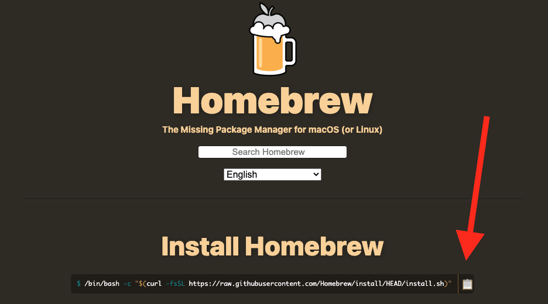

# Windows Computer Setup Guide

## WSL 2

You must install WSL2 in order to complete this course.

https://docs.microsoft.com/en-us/windows/wsl/install-win10

**NOTE:** Be sure to remember the password you set for your ubuntu user. You'll need this often.

**✅ ✅ How do I know if I completed this step? ✅ ✅**

From PowerShell, run

```powershell
wsl --list --verbose
```

Returns the Name of the Linux you installed, thr running state, the WSL version as `2` and the `*` marking default:

```text
  NAME                   STATE           VERSION
* Ubuntu-18.04           Running         2
```

If if you see something else, may need to set [wsl defaults](https://docs.microsoft.com/en-us/windows/wsl/install-win10#set-your-distribution-version-to-wsl-1-or-wsl-2) . In this case, to set the particular distro as default, use `wsl --set-default Ubuntu-18.04`.

## Ubuntu Updates

From the WSL Terminal, run the following:

```
sudo apt-get update -y
sudo apt-get install build-essential zsh -y
```

## ZSH

1. Go to https://ohmyz.sh/
1. Follow instructions

At the time of this writing, the command was:

```
bash -c "$(curl -fsSL https://raw.github.com/ohmyzsh/ohmyzsh/master/tools/install.sh)"
```

See also https://blog.joaograssi.com/windows-subsystem-for-linux-with-oh-my-zsh-conemu/

## Homebrew

**Install**

1. Visit https://brew.sh/
1. Click the "Copy" link
1. Open a new Terminal window (or tab)
1. Paste the command and hit the ENTER key



**Add to Path**

Add homebrew to your path in `~/.zshrc`

```
echo "export PATH=\"/home/linuxbrew/.linuxbrew/bin:/home/linuxbrew/.linuxbrew/sbin:\$PATH\"" >> ~/.zshrc
source ~/.zshrc
```

**Install common packages**

```
brew install gcc git
```

## IBM Cloud

Make sure to run the following commands from within the WSL Terminal

[Install the IBM Cloud Tools](./ibmcloud.md)

## Visual Studio Code

[Install VSCode with command line tools](./visual-studio-code.md)

Setup VSCode with WSL: https://code.visualstudio.com/docs/remote/wsl

## Configure Git

[Configure Git](../git/README.md) with you your username / email, ignorecase

## Docker Desktop

Follow instructions here:

https://docs.docker.com/docker-for-windows/wsl/
