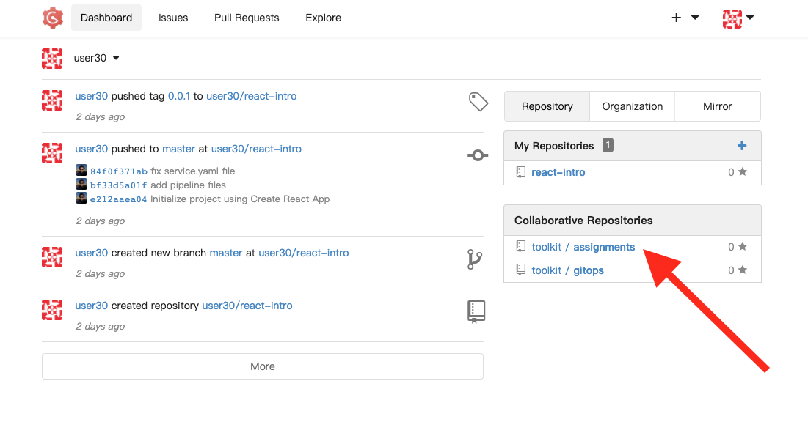
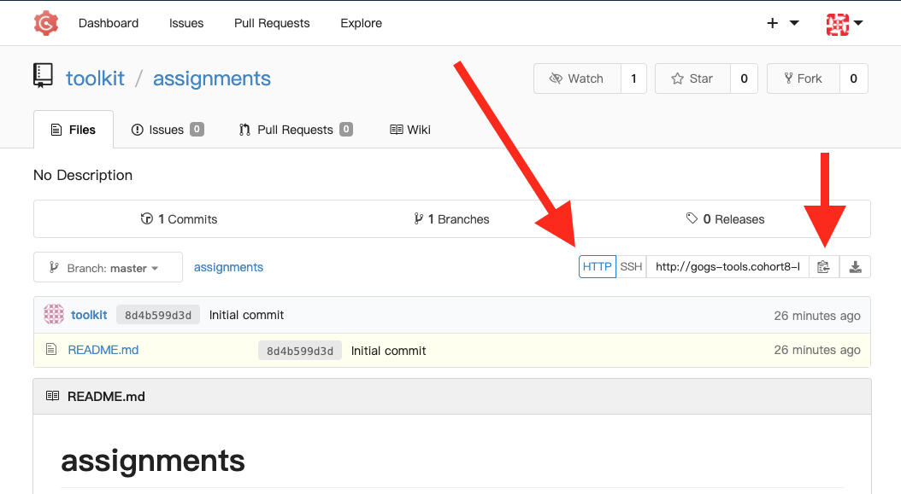
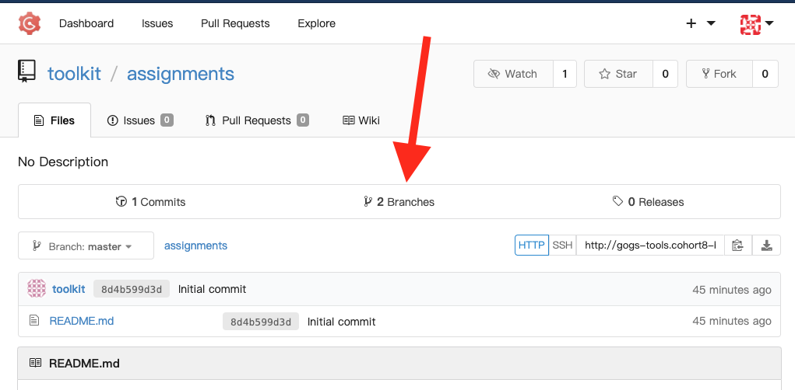
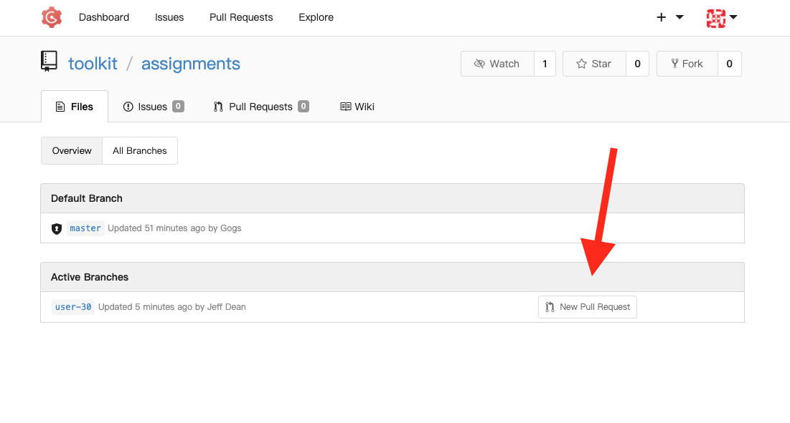
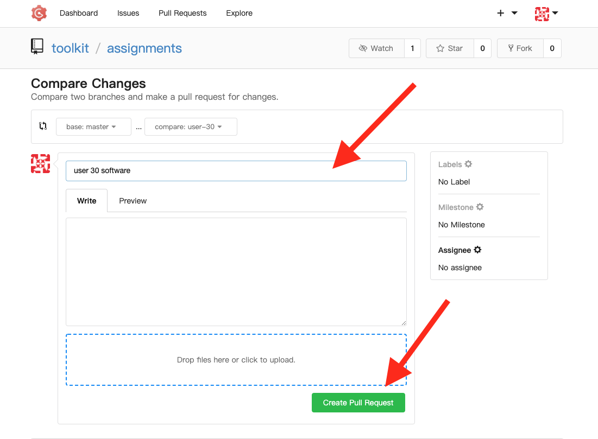

# Assignments Repo

> **NOTE** For Windows users, run all commands from within Ubuntu (WSL)

## Add your user number to `~/.zshrc`

If you haven't done so yet, set your `CGB_USER` environment variable:

1. Find your user number
1. Run the following commands - replace `XX` with your user number:

```bash
echo 'export CGB_USER="XX"' >> ~/.zshrc && source ~/.zshrc && echo $CGB_USER
```

## Open Gogs

Open the OpenShift Web Console:

```bash
oc console
```

Open the App Menu (the 9-box menu)

Click "Git Dev"


## Sign In

Click Sign In


Enter `userXX` (replace `XX` with your user number) and the password `password`


> NOTE: get your user number from your instructor

## Find the Assignments Repository

Under "Collaborative Repositories" click on "assignments".



> NOTE: if you don't see the repo there, ask your instructor to add you

## Clone the Repository

1. Make sure that "HTTP" is selected (not SSH)
1. Copy the URL



1. Run the following command in terminal

```bash
cd ~
git clone <URL>
cd assignments
```

## Create a Branch

```bash
git checkout -b user-$CGB_USER
```

## Complete your first assignment

For the first assignment, we'll just output some software versions to a file.

> **NOTE**: you can copy the entire block of code and paste it in your terminal

```bash
mkdir -p user-$CGB_USER
echo "$(brew --version || echo ERROR)" > user-$CGB_USER/software.md
echo >> user-$CGB_USER/software.md
echo "Code version $(code --version || echo ERROR)" >> user-$CGB_USER/software.md
echo >> user-$CGB_USER/software.md
echo "$(docker --version || echo ERROR)" >> user-$CGB_USER/software.md
echo >> user-$CGB_USER/software.md
echo "Helm version $(which helm || echo ERROR)" >> user-$CGB_USER/software.md
echo >> user-$CGB_USER/software.md
echo "$(git --version || echo ERROR)" >> user-$CGB_USER/software.md
echo >> user-$CGB_USER/software.md
echo "$(ibmcloud --version || echo ERROR)" >> user-$CGB_USER/software.md
echo >> user-$CGB_USER/software.md
echo "igc version $(igc --version || echo ERROR)" >> user-$CGB_USER/software.md
echo >> user-$CGB_USER/software.md
echo "node version $(node --version || echo ERROR)" >> user-$CGB_USER/software.md
echo >> user-$CGB_USER/software.md
echo "npm version $(npm --version || echo ERROR)" >> user-$CGB_USER/software.md
echo >> user-$CGB_USER/software.md
echo "oc version $(oc version || echo ERROR)" >> user-$CGB_USER/software.md
echo >> user-$CGB_USER/software.md
```

Then git add, commit and push to your branch:

```bash
git add user-$CGB_USER
git commit -m "first assignment"
git push -u origin user-$CGB_USER
```

Type your username in (for example `user06`) and the password `password`.

## Create a Pull Request

Go to the branches tab:



Find your branch and click "New Pull Request"



Add a title, and click "Create Pull Request"


