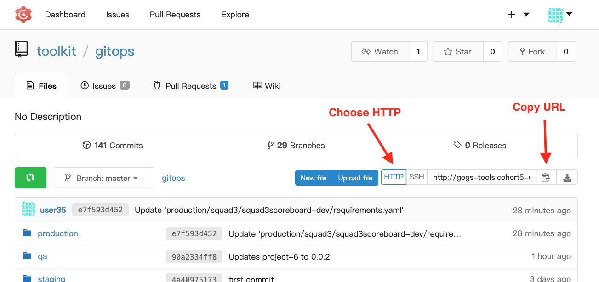

# Gogs Authentication

## Find Gogs

1. Go to the OpenShift Web Console
1. Open the App Menu (the 9-box menu)
1. Click "Git Dev"


## Clone a Repository



1. Go to the repository to clone
1. Make sure that "HTTP" is selected
1. Click the "Copy" icon
1. Open a Terminal
1. Type:

```
git clone [copied-url]
```

## Caching Credentials on Mac

Make sure you have the [keychain helper installed](https://docs.github.com/en/github/getting-started-with-github/caching-your-github-credentials-in-git).

The first time you push changes to a repository, it will prompt you for yor username and password.

The username is the user that was assigned to you in the cluster - for example `user12` or `user24`.

You should only have to type this once, and it will be cached from then on.

### Erase these credentials

```
echo "host=$(oc get route -n tools gogs --template='{{.spec.host}}')
protocol=http
" | git credential-osxkeychain erase
```

Resources:
- https://stackoverflow.com/questions/53419660/how-to-add-credentials-from-the-command-line-using-git-credential-osxkeychain-s

## Storing Credentials on Linux

In linux you can temporarily store credentials in memory:

On Windows WSL, you can optionally use the Git for Windows Credentials Manager:

Resources:
- https://stackoverflow.com/questions/45925964/how-to-use-git-credential-store-on-wsl-ubuntu-on-windows

## Storing Credentials on Windows

We don't recommend developing on Windows. You should use WSL.

If you absolutely must develop on Windows, [here's a link](https://docs.github.com/en/github/getting-started-with-github/caching-your-github-credentials-in-git) that will help you cache credentials.

