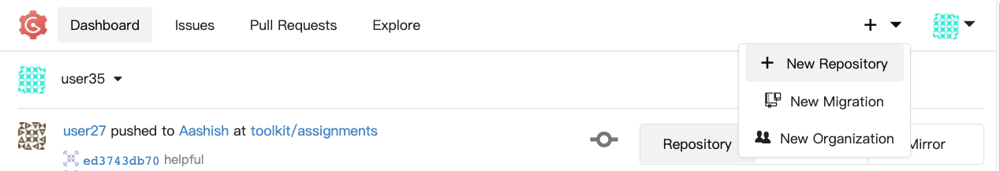
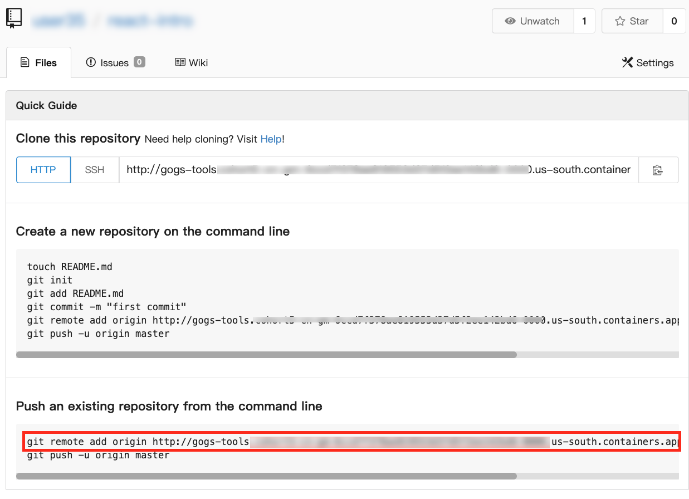

# Push a Local Git Repository to Gogs

1. Go to Gogs
1. Sign in with userX / password (no leading zeroes)
1. Click "New Repository"
   
1. Enter the repository name
1. Click "Create Repository"

   You'll see a screen like this:
   

1. Copy the command outlined in red
1. cd into the folder containing your local repository and paste it in the terminal and press enter
1. Finally, run `git push -u origin master`. Git should ask for your credentials, sign in with userX / password (no leading zeroes).
