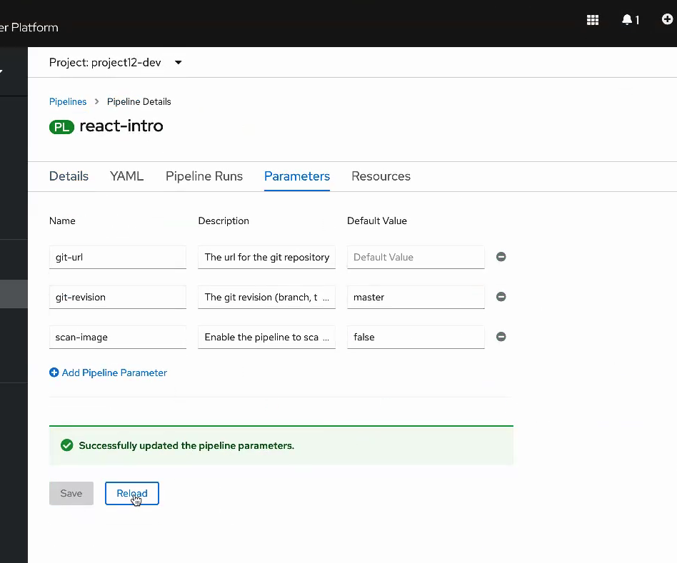

# Openshift

- [Cheatsheet](./cheatsheet.md)

## oc pipeline --tekton failures

| Error Message                                                                            | Solution                                                                                                                                                                                                                |
| ---------------------------------------------------------------------------------------- | ----------------------------------------------------------------------------------------------------------------------------------------------------------------------------------------------------------------------- |
| Error creating pipeline: "Not a git repository"                                          | cd into the application repository folder                                                                                                                                                                               |
| Error creating pipeline: It appears the kubernetes environment has not been initialized. | Go to OpenShift → Click on Your Name → Click "Copy Login Command" → Click Display Token → copy `oc login --token=...` → Paste command in the terminal and hit enter.                                                    |
| Error identifying git host                                                               | run `oc delete project project[user-number]-dev` where `[user-number]` is replaced with your assigned user number.   Wait a minute or two. run `oc sync project[user-number]-dev` then run `oc pipeline --tekton` |
| Pipeline is not triggered when pushing to master branch                                  | pipeline webhook wasn't created. Run `oc project project[user-number]-dev` where `[user-number]` is replaced with your assigned user number. cd into the application repository folder Run `oc sync`              |
| Every time I git push, my pipeline runs twice                                            | Go to gogs, click Settings → Webhook and then delete one of the webhooks                                                                                                                                                |

## Pipeline failures

You'll see the most errors the first time you are setting up the application.

**test stage**

| Error Message        | Solution                                                                |
| -------------------- | ----------------------------------------------------------------------- |
| The test stage fails | Run the following command locally and fix any errors `CI=true npm test` |

**build stage**

| Error Message                                                                                       | Solution                                                                                                                                                    |
| --------------------------------------------------------------------------------------------------- | ----------------------------------------------------------------------------------------------------------------------------------------------------------- |
| The build stage fails                                                                               | Run the following command locally and fix any errors `docker build -t [application-name] .` Replace `[application-name]` with the correct application name. |
| `error reading info about "/source/Dockerfile": stat /source/Dockerfile: no such file or directory` | [Containerize the application](../react/docker.md)                                                                                                          |

**deploy stage**

| Error Message                                                       | Solution                                                                                                                                                                                                                                                     |
| ------------------------------------------------------------------- | ------------------------------------------------------------------------------------------------------------------------------------------------------------------------------------------------------------------------------------------------------------ |
| `cp: can't create directory '/[directory-name]': Permission denied` | [Add helm charts](../helm)                                                                                                                                                                                                                                   |
| `error: deployment "react-intro" exceeded its progress deadline`    | This means the pods never came up. If you login to the project from terminal and run `oc get pods`, look for the pod that is failing (it will not be named using the pipeline run). You should see they are not running. Then describe / log them to see why |

**img-scan stage**

| Error Message            | Solution                                              |
| ------------------------ | ----------------------------------------------------- |
| The img-scan stage fails | Set `scan-image` to false  |

**tag-release stage**

| Error Message          | Solution                                                                                                                                                                                                               |
| ---------------------- | ---------------------------------------------------------------------------------------------------------------------------------------------------------------------------------------------------------------------- |
| The tag already exists | delete the tag on origin by running `git push --delete origin [tag-name]` where `[tag-name]` is replaced with the conflicting tag value. Then delete the tag locally, if it exists, by running `git tag -d [tag-name]` |

**helm-release stage**

| Error Message                                                  | Solution                                                                                                 |
| -------------------------------------------------------------- | -------------------------------------------------------------------------------------------------------- |
| `It looks like your Artifactory installation is not complete.` | Instructor should follow setup instructions at <https://cloudnativetoolkit.dev/admin/artifactory-setup/> |

## Argo failures

| Error Message                     | Solution                                                                                                                                                                                                                                                                                                                                                   |
| --------------------------------- | ---------------------------------------------------------------------------------------------------------------------------------------------------------------------------------------------------------------------------------------------------------------------------------------------------------------------------------------------------------- |
| ErrImagePull or ImagePullBackOff. | Allow your production namespace to pull images created from your dev namespace Switch to production namespace `oc project project[user-number]-production` run `oc policy add-role-to-group system:image-puller system:serviceaccounts:[PRODUCTION-PROJECT] -n [DEV-PROJECT]`  Switch back to dev namespace `oc project project[user-number]-dev` |

## Other failures

| Error Message                                               | Solution                                                                                                                                                                                                                                 |
| ----------------------------------------------------------- | ---------------------------------------------------------------------------------------------------------------------------------------------------------------------------------------------------------------------------------------- |
| Pod with a status of ErrImagePull or ImagePullBackOff.      | `oc describe pod [pod-name]` to verify status - Add an [ImagePullSecret](https://kubernetes.io/docs/tasks/configure-pod-container/pull-image-private-registry/) for the private registry.                                                |
| Container does not run, crashes, or other application error | Diagnose pod issues by looking at the logs:   `oc get pod`  `oc describe pod [pod-name]`  `oc logs [pod-name]`  `oc logs [pod-name] -f` <- streams the logs    Or run locally: `docker build ...` then `docker run...` |
