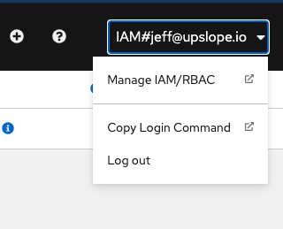

# Cheatsheet

## Debugging Steps

If your app doesn't load, there could be several issues. Here are some useful commands to help you debug:

1. `get`
1. `describe`
1. `logs`
1. `port-forward`

### get

```bash
oc get <type>
```

See the actual YAML

```bash
oc get <type> <name> -o yaml
```

### describe

Describe also shows you more details about the current state:

```bash
oc describe <type> <name>
```

### logs

```bash
oc logs <pod name>
oc logs <pod name> -f
oc logs <pod name> -c <container>
```

### port-forward

You can port-forward to a pod or service.

Replace `<pod name>` and `<service name>` with actual pod/service names:

```bash
oc port-forward pod/<pod name> 8080:8080
oc port-forward service/<service name> 8080:80
```

## Login

1. Find the cluster in IBM cloud
   1. Need to make sure you are in ITZ-V2
1. Click "OpenShift Web Console"
   1. If there's an error - refresh the page, try again
1. Click on your name
1. Click "Copy Login Command"

   

1. Click "Display Token"
1. Copy the entire `oc login...` command and paste it into your terminal

## Changing Projects

### At the command line

Run the following command, replacing `<project-name>` with the project you'd like to switch to.

```shell
oc project <project-name>
```

### In the UI

Choose your project from the project filter in the upper left.

## Common Questions

**Which project am I on?**

```shell
oc project
```

**Which plugins are installed?**

```shell
oc plugin list
```

Plugins are installed globally using npm. If no plugins are listed, it may because you switched node versions using `nvm` or because the global npm packages are not in your PATH.

Run the following command to find the installation location for global packages:

```shell
npm root -g
```

## More information

For detailed information, see [Getting started with the OpenShift CLI](https://docs.openshift.com/container-platform/4.7/cli_reference/openshift_cli/getting-started-cli.html)
