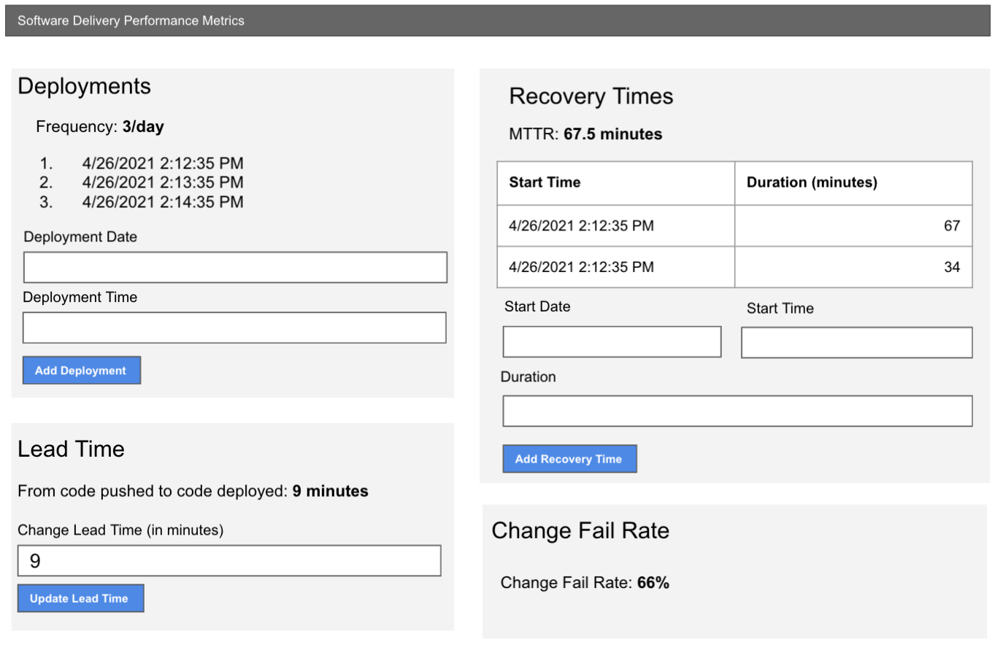

# Projects

## Kickoff

1. Meet in your squad's main room
1. One person shares their screen and:
1. Creates a React app on their local machine
   1. Creates a Gogs repo
   1. Gives access to everyone (either by putting the repo in an org, or by just adding collaborators)
   1. Pushes the React app to the gogs repo
1. Everyone else:
   1. Clones the Gogs repo (then `cd` into it)
   1. Runs `npm install` to install the project dependencies
   1. Runs `npm start` to make sure they can run the app locally

## Wireframes

## Assumptions

- You only need to target desktop Chrome users (no need to support mobile, Safari etc...)
- It only needs to work for the `en-US` locale
- It does not need any server-side component (no database or API to store the data) - `localStorage` is fine
