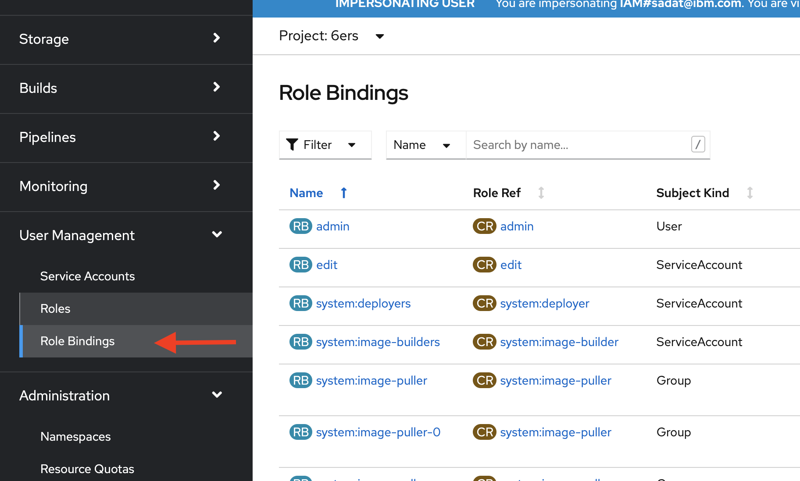
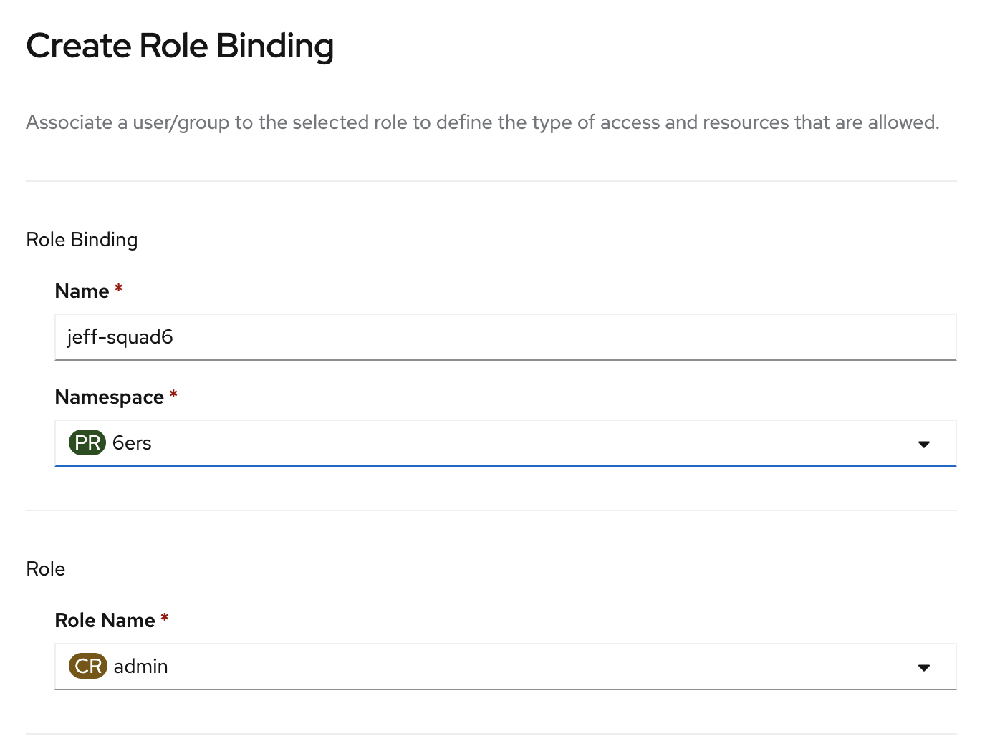
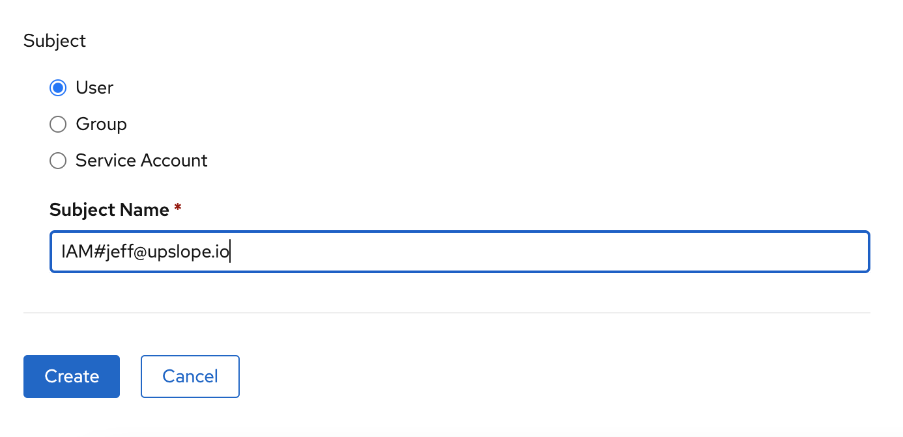

# Assigning Project Permissions

When you create a project using `oc sync <project name>` you are given admin rights.

This means that you can:

- run policy commands
- run `oc sync` again on the same project

Other users on your team are not given this permission by default.

To give your other team members permissions:

1. Switch to "Administrator" view
1. Navigate to User Management > Role Bindings
   
1. Add a name (for example `joe-admin`)
1. Select the namespace (the same as the project you created - like `squad1-dev`)
   
1. Add the user. It will be `IAM#<email>` where the email is all lowercase
   
1. Click create
