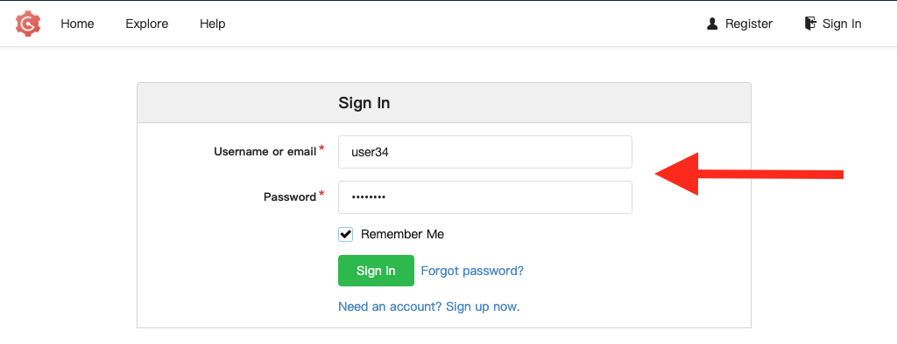

# React

> **NOTE** For windows users, run all commands from within Ubuntu (WSL)

## Create the react app

First, create a new React app:

```
npx create-react-app react-intro
cd react-intro
```

## Start the react app

```
npm start
```

This should open http://localhost:3000

You should see a React welcome page.

## Create the repo in gogs

1. Open the OpenShift Web Console
   ```
   oc console
   ```
1. Open the App Menu (the 9-box menu)
1. Click "Git Dev"
   
1. Click Sign In
   
1. Enter `userXX` and the password `password`
   
   > NOTE: get your user number from your instructor
1. Click "New Repository"
   
1. Enter the name `react-intro`
   
1. Copy the command at the bottom of the screen
   
1. Paste the two lines in your Terminal
1. Username is `userXX`
1. Password is `password`
1. Refresh your repository page
   


## Future reading

- [Testing a React App](./testing.md)
- [Containerizing a React App](./docker.md)
