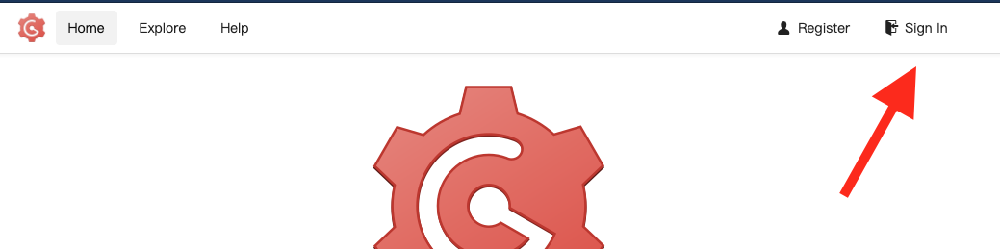
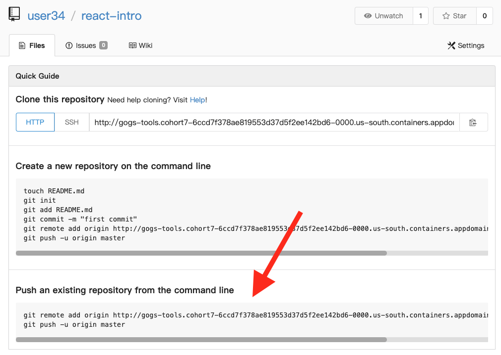

# React

> **NOTE** For windows users, run all commands from within Ubuntu (WSL)

## Create the react app

First, create a new React app:

```
cd ~
npx create-react-app react-intro
cd react-intro
```

## Start the react app

```
npm start
```

This should open http://localhost:3000

You should see a React welcome page.

## Open Gogs

Open the OpenShift Web Console

```
oc console
```

Open the App Menu (the 9-box menu)

Click "Git Dev"


## Sign In

Click Sign In



Enter `userXX` and the password `password`


> NOTE: get your user number from your instructor

## Create Repository

Click "New Repository"


Enter the name `react-intro`


Click "Create Repository"

## Push Local Code to Gogs

Copy the command at the bottom of the screen



Paste the two lines in your Terminal, and use the following credentials:

- Username is `userXX`
- Password is `password`

Refresh your repository page


## Future reading

- [Testing a React App](./testing.md)
- [Containerizing a React App](./docker.md)
