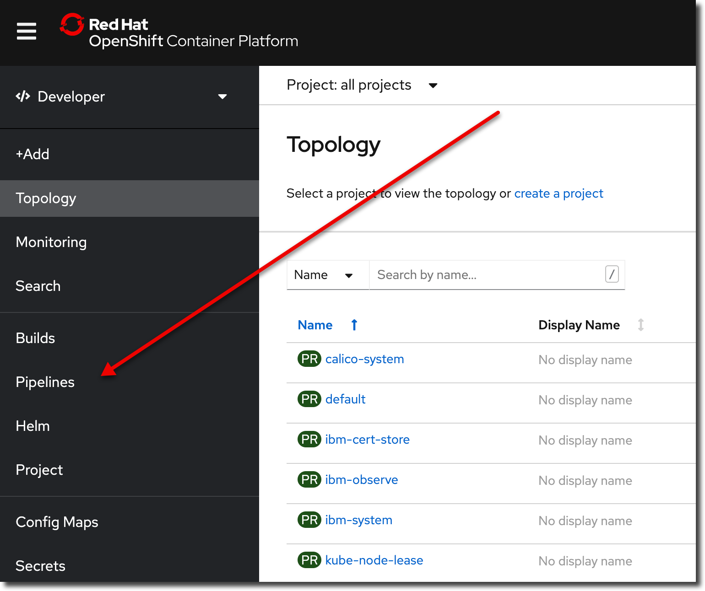

# CI with Tekton

## Go into your react-intro application

```
cd ~/react-intro
```

## Make sure that tests pass

Run the following command:

```
CI=true npm test
```

> 🛑 &nbsp;&nbsp; **NOTE:** You should see that all of your tests pass. If all of your tests don't pass, do not continue. Fix your tests.

## Make sure your code is on Gogs

Run the following command:

```
git status
```

You should have no changes to commit. If you have changes to commit.

```
git add -A
git commit -m "changes for pipeline"
git push origin master
```

## Log Into the cluster

```java
icc <cluster name>
```

For example: `icc cohort7`

> 🛑 &nbsp;&nbsp; **If ICC doesn't work for you** open the OpenShift Web Console and login via "Copy Login Command"

## Create a new project

Make sure your user number is set in your environment:

```
echo $CGB_USER
```

You should see something like `03`

```
oc sync react-intro-$CGB_USER-dev
```

You should see output like this:

```
Setting up namespace react-intro...
Setting up namespace: react-intro...
Checking for existing project: react-intro...
Creating project: react-intro...
Copying ConfigMaps
Copying Secrets
Setting current project to react-intro...
```

Then type `oc project` and you should see:

```
Using project "react-intro-99-dev" on server "https://c109-e.us-east.containers.cloud.ibm.com:31982".
```

> 🛑 &nbsp;&nbsp; If you see `Using project "default"` it means your project creation did not work. Make sure you are logged in and have permissions. You may need to contact your instructor.

### Create the Tekton Pipeline

Create the pipeline:

```
oc pipeline --tekton
```

- `Select the Pipeline to use in the Pipeline Run:` choose the most appropriate pipeline for your project
  - For React, choose `ibm-nodejs`
- `Image scan (y/n)` type `n`
- `Lint dockerfile (y/n)` type `n`

This will create a new pipeline and add the application to the gitops repository `qa` environment.

If successful, the Pipeline Run URL is printed out. CMD+click on the URL to open in your default browser and see if the pipeline passes or fails.

> 🛑 &nbsp;&nbsp; If the pipeline fails, use the troubleshooting tables below to fix the failure:

1. Run `oc console` to open a console
1. In the sidebar, go to Pipelines
1. Click the latest Pipeline Run
1. Verify that your `test` stage passes

## Adding the Dockerfile

Add the following file to the root of your `react-intro` app:

`nginx.conf` (same as above):

```
server {
    listen       8080;
    server_name  localhost;
    location / {
        root   /usr/share/nginx/html;
        index  index.html index.htm;
        try_files $uri $uri/ /index.html =404;
    }
    error_page   500 502 503 504  /50x.html;
    location = /50x.html {
        root   /usr/share/nginx/html;
    }
}
```

Add the following file to the root of your `react-intro` app:

`Dockerfile`

```
FROM quay.io/jeffdean/node-alpine as build
WORKDIR /app
COPY . .
RUN npm install
RUN npm run build

FROM quay.io/jeffdean/nginx-unprivileged
COPY --from=build /app/build /usr/share/nginx/html
COPY --from=build /app/nginx.conf /etc/nginx/conf.d/default.conf
```

Then from the command line, to build you would execute the following commands:

```
# no need to run npm build
docker build --no-cache -t dockerized-react-app .
docker run -it -p 8080:8080 --rm dockerized-react-app
```

Then open http://localhost:8080 in your browser to see it work.

Once it works locally:

- Git add commit and push
- Verify that the "build" stage in your pipeline passes

---

## Add the Helm Chart

1. Download [this zip file](https://github.com/upslopeio/ibm-cloud-garage-training/raw/main/helm/chart.zip)
   1. You can [see the contents here](https://github.com/upslopeio/ibm-cloud-garage-training/tree/main/helm/chart)
1. Unzip the file
1. Move the `chart` directory to your `react-app` folder. For example:

```
pwd # <-- make sure you are in the react-intro directory
mv ~/Downloads/chart .
```

1. Git add / commit and push
1. View your pipeline run in the OpenShift console
1. Verify that the "Deploy" step passes

## Pipeline failures

You'll see the most errors the first time you are setting up the pipeline.

| Error Message                          | Solution                                                                                                                                                                                                                                                                              |
| -------------------------------------- | ------------------------------------------------------------------------------------------------------------------------------------------------------------------------------------------------------------------------------------------------------------------------------------- |
| Error Unable to identify git host type | You may have entered your GitHub credentials, not `userXX` and `password` for Gogs. In OC Console, click developer view, select your project, then select "Secrets" on the left, then select `git-credentials`, then "Actions", then "Edit Secret", enter in `userXX` and `password`. |

**test stage**

| Error Message        | Solution                                                                |
| -------------------- | ----------------------------------------------------------------------- |
| The test stage fails | Run the following command locally and fix any errors `CI=true npm test` |

NOTE: if you want to ignore a failing test (just so you can move onto the next stage during class) you can change `test` to `test.skip`

**build stage**

| Error Message                                                                                     | Solution                                                                                                                                                    |
| ------------------------------------------------------------------------------------------------- | ----------------------------------------------------------------------------------------------------------------------------------------------------------- |
| error reading info about "/source/Dockerfile": stat /source/Dockerfile: no such file or directory | [Containerize the application](../react/docker.md)                                                                                                          |
| The build stage fails                                                                             | Run the following command locally and fix any errors `docker build -t <application-name> .` Replace `<application-name>` with the correct application name. |

**deploy stage**

| Error Message                                                     | Solution                                                                                                                                                                                                                                                                                                                             |
| ----------------------------------------------------------------- | ------------------------------------------------------------------------------------------------------------------------------------------------------------------------------------------------------------------------------------------------------------------------------------------------------------------------------------ |
| cp: can't create directory '/<directory-name>': Permission denied | [Add helm charts](../helm) <br> render locally with `helm template <release-name> ./chart/base` where `<release-name>` is the name of your application in all lower case.                                                                                                                                                            |
| error: deployment "react-intro" exceeded its progress deadline    | This means the pods never came up. If you login to the project from terminal and run `oc get pods`, look for the pod that is failing (it will not be named using the pipeline run). You should see at least one that is not running. Then `oc describe pod <pod-name>` and/or `oc logs <pod-name>` to find out why it is not running |
| `error: object has been deleted`                                  | The namespace or Argo project name is the same as your repository name. Delete the namespace or Argo project and recreate it with a new unique name.                                                                                                                                                                                 |

**dockerfile-lint stage**

| Error Message               | Solution                                                                          |
| --------------------------- | --------------------------------------------------------------------------------- |
| dockerfile-lint stage fails | Set `lint-dockerfile` to `false` in the pipeline parameters (see the image below) |

**img-scan stage**

| Error Message            | Solution                                                                     |
| ------------------------ | ---------------------------------------------------------------------------- |
| The img-scan stage fails | Set `scan-image` to `false` in the pipeline parameters (see the image below) |

**health stage**

| Error Message                            | Solution                                                                      |
| ---------------------------------------- | ----------------------------------------------------------------------------- |
| contains `https://` in the error message | Add a `health-protocol` key with a value of `http` to the pipeline parameters |

**tag-release stage**

| Error Message          | Solution                                                                                                                                                                                                               |
| ---------------------- | ---------------------------------------------------------------------------------------------------------------------------------------------------------------------------------------------------------------------- |
| The tag already exists | delete the tag on origin by running `git push --delete origin <tag-name>` where `[tag-name>` is replaced with the conflicting tag value. Then delete the tag locally, if it exists, by running `git tag -d <tag-name>` |

**helm-release stage**

| Error Message                                                | Solution                                                                                                 |
| ------------------------------------------------------------ | -------------------------------------------------------------------------------------------------------- |
| It looks like your Artifactory installation is not complete. | Instructor should follow setup instructions at <https://cloudnativetoolkit.dev/admin/artifactory-setup/> |

## Other failures

| Error Message                                               | Solution                                                                                                                                                                                                                                 |
| ----------------------------------------------------------- | ---------------------------------------------------------------------------------------------------------------------------------------------------------------------------------------------------------------------------------------- |
| Pod with a status of ErrImagePull or ImagePullBackOff.      | `oc describe pod <pod-name>` to verify status - Add an [ImagePullSecret](https://kubernetes.io/docs/tasks/configure-pod-container/pull-image-private-registry/) for the private registry.                                                |
| Container does not run, crashes, or other application error | Diagnose pod issues by looking at the logs: <br> `oc get pod`<br> `oc describe pod <pod-name>`<br> `oc logs <pod-name>`<br> `oc logs <pod-name> -f` <- streams the logs<br> <br> Or run locally: `docker build ...` then `docker run...` |

## Pipeline parameters

The following is a screenshot of the pipeline parameters page:


## Finding your pipeline

1. Select developer view
   
1. Select pipelines
   
1. Filter projects by name
   
