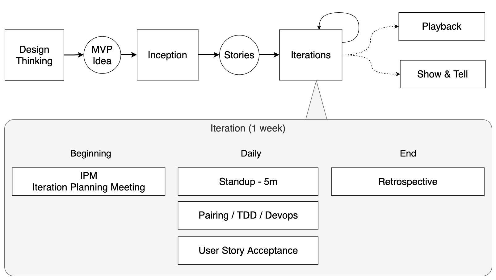

# Project Timeline

## Design Thinking

Design thinking activities help customers define an idea that they'd like to validate. This idea is often called an MVP - "Minimum Viable Product" (or "Minimum Valuable Product").

* **Cadence**: Once, at the beginning of a project

## Inception

Inceptions happen **once** after Design Thinking but before the squad starts writing code.

* **Cadence**: Once, at the beginning of a project
* **Duration**: Between 2 hours to 1 day
* **Participants**: Product Owner, Developers, UX Designers, SMEs from the customer, maybe Architects
* **Purpose**: The purpose of the Inception is to generate a list of 2-3 weeks worth of User Stories

## Iterations

Iterations are 1 week long.

A standard iteration follows a schedule like this:

### Iteration Planning Meeting (IPM)

Iteration Planning Meetings happen once a week, at the beginning of every iteration.

* **Cadence**: Once per iteration, at the beginning
* **Duration**: 30 minutes - 1 hour
* **Participants**: The squad (Product Owner, Developers, UX Designer)
* **Purpose**: Review the backlog and make sure everyone on the squad understands the stories coming up

### Standup

Standup happens once per day at the beginning of the day

* **Cadence**: Daily
* **Duration**: 5 minutes or less
* **Participants**: The squad (Product Owner, Developers, UX Designer)
* **Purpose**: To determine who is pairing with whom on what story

### Working the Backlog

Most of a developer's time will be spent working the backlog. This includes:

- Pair Programming
- Test-Driven Development
- Devops (deploying stories to production)

### Retrospectives

Retrospectives happen once per iteration

* **Cadence**: Once per iteration, at the end
* **Duration**: 30-60 minutes
* **Participants**: The squad (Product Owner, Developers, UX Designer)
* **Purpose**: To figure out how to do more of what works, and less of what doesn't. The primary way teams do continuous improvement.

## Playbacks

Playbacks allow squads to show their work and engage in meaningful conversations with stakeholders about product direction, challenges, successes etc. 

* **Cadence**: Periodically
* **Duration**: 30 minutes - 1 hour
* **Participants**: A big meeting. The squad (Product Owner, Developers, UX Designer) plus stakeholders from the customer, architects etc...
* **Purpose**: Keep stakeholders up-to-date on what's happening, get feedback and ideas from a bigger group of people

## Show and Tell

Show and tell is a technical meeting of developers to share their code (following all confidentiality agreements) with each other.

* **Cadence**: Periodically
* **Duration**: Up to the participants
* **Participants**: Developers from across the sales org
* **Purpose**: Share technical tips, tricks, techniques so that everyone can continue to get better technically
